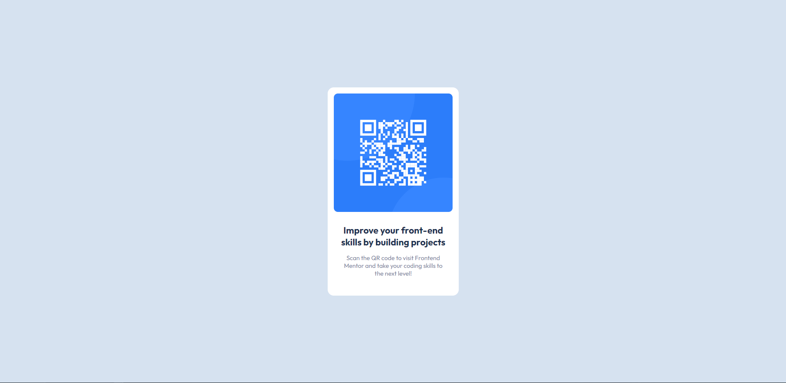

# Frontend Mentor - QR code component solution

This is a solution to the [QR code component challenge on Frontend Mentor](https://www.frontendmentor.io/challenges/qr-code-component-iux_sIO_H). Done by [igafshell](https://github.com/igafshell)

## Table of contents

- [Overview](#overview)
  - [Screenshot](#screenshot)
  - [Links](#links)
- [My process](#my-process)
  - [Built with](#built-with)
  - [What I learned](#what-i-learned)
  - [Continued development](#continued-development)
- [Author](#author)

## Overview

This is a stylish qr code component that can be used in all sorts of layouts.

### Screenshot

### Links

- Live Site URL: [Here](https://igafshell.github.io/frontendmentor-qrcode-challenge/)

## My process

I started with writing the html layout. The basic structure consists of a `<main>` element that serves the role of a container with 2 children elements - the qr code `` element and a `
` containing all the text.

Then I started with the css. First, I centered the `<main>` using flexbox on the `<body>` and gave the container a fixed size. Then I went on to arranging the elements inside the container and for that I used flexbox too. I gave the `` `width: 100%;` to fit the size of the container and the `.text` some margins and styling.

### Built with

- Semantic HTML5 markup
- Basic Flexbox
- Flexbox

### What I learned

I learned how to use basic flexbox proprieties and how to arrange elements inside a container using flexbox, paddings and margins. Also, I learned how to use [frontendmentor.com](frontendmentor.com), which has been a very interesting experience, and learn how to use Git and GitHub, which I haven't used before.

### Continued development

For my next projects, I will focus more on:

- Mastering basic css, flexbox and grid
- Getting more familiar with Git
- Writing more readable code

## Author

- Github - [igafshell](https://github.com/igafshell)
- Frontend Mentor - [@igafshell](https://www.frontendmentor.io/profile/igafshell)

<!-- test -->
